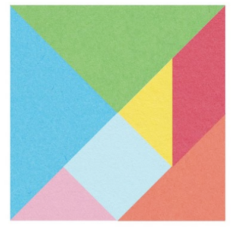
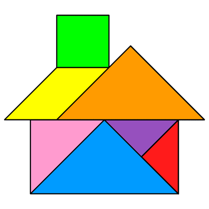

# Computational Thinking Warm-Up

## Part 1: MS Code Tangrams
### Tangrams
The ancient tangram puzzle is an interesting starting point for learning about Computational Thinking:



With these seven shapes, thousands of different objects can be constructed. For instance, here is a house object made from Tangrams:

 

### Computational Thinking
Computational Thinking is a prerequisite for problem solving with code. In a broad sense, Computational Thinking refers to approaching a problem from the perspective of using a computer to produce a solution. Computational Thinking can be broken down into four perspectives:
- #### Decomposition
    Decomposition refers to splitting a complex problem into smaller, easier-to-understand component pieces.
    Coding uses abstraction to create smaller, intermediary subprograms which can be connected together to form a complete solution.
    Every Tangram puzzle breaks down a larger object into smaller, well-defined pieces.

- #### Abstraction
    Abstraction refers to focusing first on essential, big-picture details over small, granular details.
    Coding uses abstraction by hiding unnecessary details when they aren't important. Coding libraries make complicated things easier to use and understand by making it so that programmers "don't have to sweat the small stuff".
    Tangram objects don't look like real objects. However we use abstraction to approximate a big-picture, recognizable similarity.

- #### Recognizing Patterns 
    Recognizing patterns is the process of looking for connections to simplify understanding how the various pieces of a puzzle fit together. 
    Coders attempt to recognize patterns to reduce and reuse the code that they write.  This also leads to understanding the best way to represent  data in order to solve a problem.
    Every Tangram puzzle reuses the same collection of 7 shapes, so every solution can be broken down into the same 7 pieces.

- #### Algorithms
    An algorithm is an ordered sequence of problem solving steps that can be followed in order to solve a problem.
    Coding essentially translates problem solving steps into a language computers can understand.
    Each tangram piece must be translated, rotated, or reflected before being placed in its final position. Translating your picture-based solution into an algorithm would require listing a precise order of transformations each piece should undergo before becoming part of the final solution.

### Activity
1. Google "tangram puzzle" and search around for a puzzle you find interesting.
    - Pick a tangram puzzle other than the house. 

2. Use [Microsoft Paint](https://apps.microsoft.com/store/detail/paint/9PCFS5B6T72H) to draw a tangram solution for this puzzle. 
    - Use lines and the paint bucket/fill tool to draw each shape.
    - Each shape should have a different fill color. 
    - All shapes should have the same outline/stroke color. 
    - *Hint*:  Hold down SHIFT while drawing a line to lock lines into horizontal/vertical/45o diagonal orientations.

## Part 2: VS Code Tangrams

### Run tangram.py with VS Code.
VS Code is a source code editor that makes coding in Python (and most other languages) really easy.

Here are the steps you should follow to run the tangram .py demo:

1. Create an `AMP_CS` folder on your desktop.
    - This folder will help you organize all of the Python files you’ll work with over the summer.
2. Download `tangram.py` to your `AMP_CS` folder.
3. Open VS Code
4. Use VS Code to open `tangram.py`
5. Click on the Play button to Run the Python File. 
6. A graphics window will open with the resulting graphic.
    -Note: You can close the graphic window by clicking the red circle 

### Getting to Know tangram.py
Python is a high-level coding language that is designed to read similar to English.

There are two sections of code in tangram.py:
- The `tangram_square()` function definition
- The `if __name__ == "__main__":` entry point for the Python interpreter

#### `tangram_square()`
This section of code defines all the steps/code needed to actually draw the square tangram puzzle. 

#### `if __name__ == "__main__":`
This section of code is where the program actually starts running. We'll refer to this as the `"__main__"` section.

You can probably infer from the text that this where we can set and change the size of the graphics window:
```python
if __name__ == "__main__":
    appWidth = 500
    appHeight = 500
    ...
   
    tangram_square()

    ...
```

Notice how there is a call to the `tangram_square()` function on line 65. 

### Indentation
Indentation is very important for Python syntax. Notice how both the `tangram_square()` section and the  `if __name__ == "__main__":` section use a consistent indentation.

VS Code provides graphical hints to help you keep track of syntax.

### Activity
For each of these activities, be sure to close the old graphics window before moving on the next exercise. 
If you don't close the old graphics window, then it will look like the Play button isn't working.

1. Change the appWidth variable to 800. 
    - Save your changes, then rerun the code.
    - What happens as a result of this change?

2. Change the appHeight variable to 800
    - Save your changes, then rerun the code.
    - What happens as a result of this change?

3. Change to the fill color of all 7 tangram pieces to `"purple"`
    - Save your changes, then rerun the code.
    - What happens as a result of this change?

4. Make a small change to the indentation of `tangram_square()` statement in the `"__main__"` section:
    ```python
    if __name__ == "__main__":
        appWidth = 500
        appHeight = 500

        app = tk.Tk()
        app.title("Curve Stitching")
        app.geometry(f"{appWidth}x{appHeight}")
        canvas = tk.Canvas(app, bg="#FFFFFF", width=appWidth, height=appHeight)
        canvas.pack()

          tangram_square()      

        app.mainloop()
    ```
    - Save your changes, then rerun the code.
    - How does VS Code let you know there is a mistake in the code?

5. Remove the underscore in the call to the `canvas.create_polygon` which draws the large blue triangle:
    ```python
    def tangram_square():
        large_triangle_1 = [
            50, 50,
            50, 450,
            250, 250
        ]
        canvas.create polygon(large_triangle_1,  fill='blue', outline='black')

    ```
    - Save your changes, then rerun the code.
    - How does VS Code let you know there is a mistake in the code?

