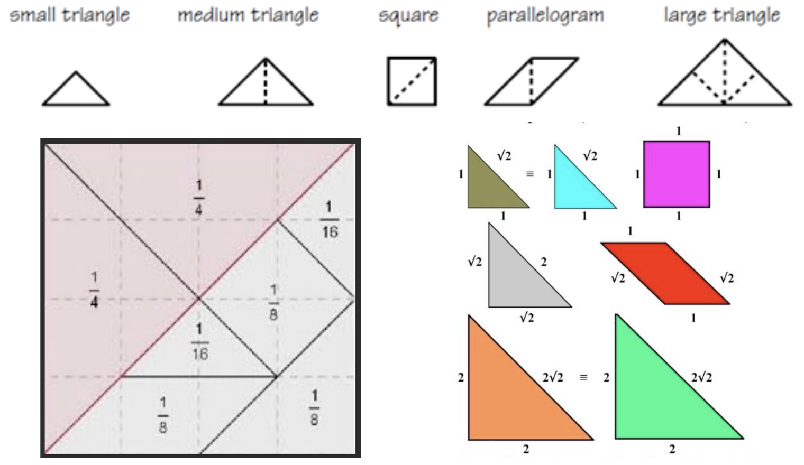

# Computational Thinking Activity #1: Tangrams

## Python Tkinter Basics
- Walk though of Warm-Up activities
- Discussion on Exercise answers
- You should be able to keep a high level of abstraction and skip the details on how TKinter works

### Computer Graphic typically assign the upper-left corner of a window as the origin
- (0,0) in upper-left
- Increase y to move down

## Activity
1. Use Python Tkinter to draw the Tangram puzzle you picked for the Warm-Up activity.
    - Use the polygon function to draw each shape
    - Tkinter doesn’t have built-in rotations, reflections or transformations
    - Microsoft Paints makes it easy to find shape coordinates 
    - Strong math students might want to calculate their own coordinates for a challenge:
    

## Teacher Notes
