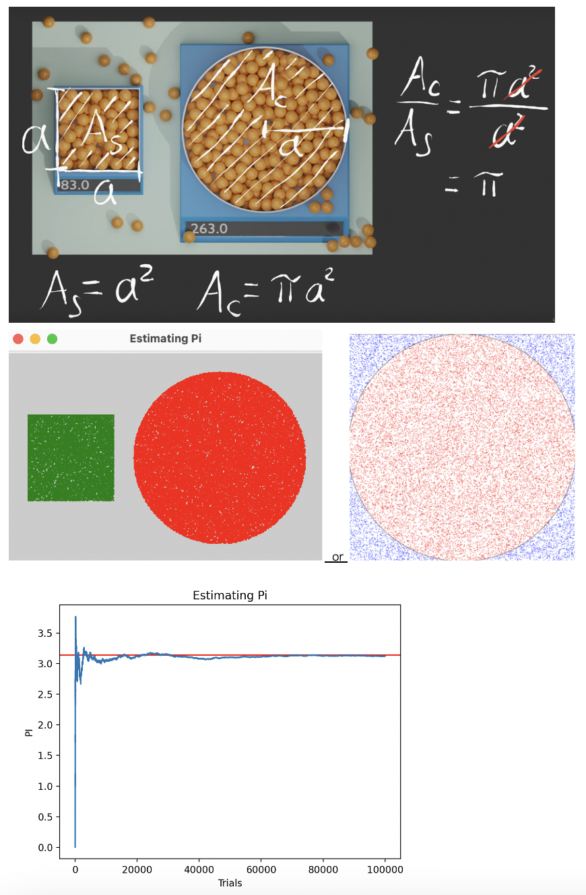

# Computational Thinking Activity #3: Throwing Darts

## Activity

## Setup
While studying to [pick stocks by throwing darts at newspapers](https://www.forbes.com/sites/rickferri/2012/12/20/any-monkey-can-beat-the-market/?sh=78df2f39630a), monkeys also learn to approximate pi using a similar approach. 

## Teacher Notes